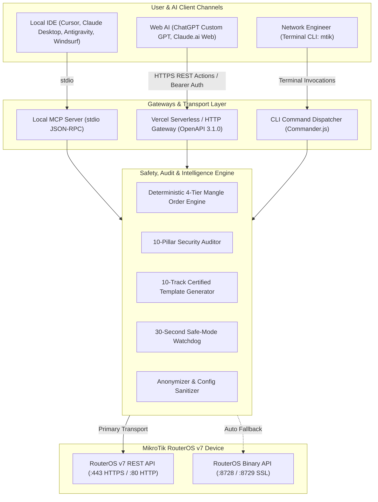
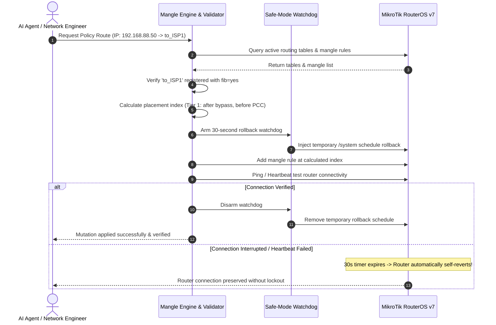

```text
  MMM      MMM       KKK                          TTTTTTTTTTT      KKK
  MMMM    MMMM       KKK                          TTTTTTTTTTT      KKK
  MMM MMMM MMM  III  KKK  KKK  RRRRRR     OOOOOO      TTT     III  KKK  KKK
  MMM  MM  MMM  III  KKKKK     RRR  RRR  OOO  OOO     TTT     III  KKKKK
  MMM      MMM  III  KKK KKK   RRRRRR    OOO  OOO     TTT     III  KKK KKK
  MMM      MMM  III  KKK  KKK  RRR  RRR   OOOOOO      TTT     III  KKK  KKK

  MikroTik RouterOS v7 Skill & Automation Toolkit (CLI & MCP Server)
```

# MikroTik RouterOS v7 Skill & CLI Toolkit

[](https://github.com/ardianryan/mikrotik-skill/actions/workflows/ci.yml)
[](https://nodejs.org/)
[](https://www.typescriptlang.org/)
[](https://mikrotik.com/)
[](https://www.gnu.org/licenses/gpl-3.0)

> **Personal Daily Productivity & Network Automation Toolkit**  
> Authored by **Ardian Ryan** (<me@ardianryan.com>) to streamline network operations, multi-WAN load balancing, automated security auditing, and safe rule deployment on MikroTik RouterOS v7 devices.

---

## CRITICAL NOTICE & DISCLAIMER

> [!CAUTION]
> ### STRICT ROUTEROS v7 REQUIREMENT
> This toolkit is **ENGINEERED EXCLUSIVELY FOR MIKROTIK ROUTEROS v7** (v7.1+).  
> **DO NOT USE THIS TOOL ON ROUTEROS v6.** RouterOS v6 utilizes completely incompatible syntax for routing tables, FIB allocation, and firewall mangle rules, and lacks the native REST API subsystem.

> [!WARNING]
> ### NOT RECOMMENDED FOR DIRECT PRODUCTION DEPLOYMENT
> This software is intended as an automation assistant for personal and homelab environments.  
> **IT IS STRONGLY ADVISED NOT TO RUN BLIND MUTATIONS DIRECTLY ON MISSION-CRITICAL ENTERPRISE PRODUCTION NETWORKS WITHOUT RIGOROUS STAGING.**
>
> 1. **Always use Sandbox / Lab Mode first:** Test all rules and configurations on a local virtual machine (MikroTik Cloud Hosted Router / CHR) or testing workbench.
> 2. **Always use `--dry-run`:** Preview the colored visual diff of every proposed rule before applying it to physical hardware.
> 3. **Verify Watchdog Rollback:** Ensure safe-mode watchdog timers are active before mutating default routing or input firewall chains.

> [!IMPORTANT]
> ### DO AT YOUR OWN RISK (WARRANTY DISCLAIMER)
> THIS SOFTWARE IS PROVIDED "AS IS", WITHOUT WARRANTY OF ANY KIND. NETWORK AUTOMATION CAN CAUSE IMMEDIATE DEVICE LOCKOUT, PACKET ROUTING LOOPS, OR SERVICE INTERRUPTIONS IF MISCONFIGURED. YOU ASSUME FULL AND SOLE RESPONSIBILITY FOR ANY NETWORK OUTAGE, DATA LOSS, OR HARDWARE MISBEHAVIOR RESULTING FROM THE USE OF THIS TOOL.

---

## Overview

Managing MikroTik routers in multi-WAN environments often involves repetitive `.rsc` exports, delicate Mangle ordering, and the constant risk of lockout. 

**MikroTik Skill & CLI Toolkit** is a modular, type-safe automation suite designed to solve this. It provides both a powerful terminal CLI (`mtik`) and a Model Context Protocol (MCP) server (`mtik-mcp`) allowing AI coding assistants (such as Antigravity, Cursor, and Claude Desktop) to audit, inspect, and safely configure RouterOS v7 infrastructure with zero hallucinations.

---

## Key Features

- **Dual-Engine Connection:**
  - **Primary:** High-speed RouterOS v7 native REST API (`/rest`, HTTPS/HTTP) with structured JSON responses and self-signed certificate tolerance.
  - **Automatic Fallback:** Seamless fallback to RouterOS native binary API socket (Port 8728 / 8729 SSL) if WebFig or REST is disabled.
- **Automated 7-Pillar Security Audit:**
  - One-command audit evaluating DNS open resolvers, exposed administrative services, missing firewall input drops, NTP clock drift, and Mangle Hairpin NAT leak risks.
- **Deterministic Mangle Order Engine:**
  - Prevents packet misrouting by enforcing the strict RouterOS hierarchy: **Bypass Rules** (`connection-nat-state=dstnat`, `LOCAL_BYPASS`) at index 0 $\rightarrow$ **Dedicated Client Overrides** $\rightarrow$ **PCC Load Balancing**.
- **FIB Integrity Validation:**
  - Verifies custom routing tables are declared in `/routing table` with `fib=yes` before any Mangle rule is injected.
- **30-Second Safe-Mode Watchdog:**
  - Automatically arms a temporary `/system schedule` rollback timer before critical changes. If connection is interrupted or unverified within 30 seconds, the router reverts the change automatically.
- **Auto-Sanitizer Export (`mtik backup --sanitize`):**
  - Exports structured JSON snapshots with automatic redaction of MAC addresses (`XX:XX:XX...`), serial numbers, passwords, shared secrets, and VPN network IDs—making exports 100% safe to share with AI or public forums.
- **Real-Time Terminal Bandwidth Monitor (`mtik monitor`):**
  - Live throughput meter in the terminal tracking RX/TX (Mbps/Kbps) across WAN and LAN interfaces.
- **Container & DNS Adlist Management:**
  - Inspect and restart local Docker microservices (`mtik container`) and manage network-wide adblocker feeds (`mtik adlist`).
- **Enterprise Reference Runbooks:**
  - Modular guides covering 802.1X/RADIUS (EAP-PEAP/TLS), Dynamic VLAN assignment, Modern CAKE/FQ-CoDel QoS, Captive Portal Walled Gardens, WireGuard Zero-Trust, and RouterOS v7 Docker containers.

---

## Architecture & How It Works

### 1. System Topology & Integration Gateways



### 2. Use Case Flow: Safe Mutation with 30s Watchdog Rollback



---

## Installation & Setup

### 1. Requirements
- Node.js >= 20.0.0
- MikroTik Router running RouterOS v7.1 or higher

### 2. Quickstart
```bash
# Clone the repository
git clone https://github.com/ardianryan/mikrotik-skill.git
cd mikrotik-skill

# Install dependencies
npm install

# Build TypeScript
npm run build

# Link CLI globally to your terminal
npm link
```

### 3. Configure Credentials
Create a `.env` file in your working directory or project root:
```env
ROUTEROS_HOST=192.168.88.1
ROUTEROS_USER=admin
ROUTEROS_PASSWORD=your_secure_password

# Optional Port Overrides
ROUTEROS_REST_PORT=443
ROUTEROS_USE_SSL=true
ROUTEROS_API_PORT=8728
ROUTEROS_API_SSL_PORT=8729

# Optional API Key for Remote / Vercel / ChatGPT Action Gateway
MTIK_API_KEY=your_secret_api_token
```

---

## 🚀 Easy-to-Use Guide

Choose the integration method that best fits your engineering workflow:

| Mode | Target Platform | Deployment Required? | Usage Model |
| :--- | :--- | :---: | :--- |
| **Mode 1: Local IDE** | **Cursor, Claude Desktop, Antigravity, Windsurf** | ❌ **Zero Deploy** | Runs 100% locally via `stdio`. Direct local socket connection to router (`192.168.88.1`). |
| **Mode 2: Web AI (Prompt)** | **ChatGPT Web, Claude.ai Web** | ❌ **Zero Deploy** | Export instructions via `mtik prompt`, paste into Custom GPT/Claude Project. AI generates 1-click ready scripts. |
| **Mode 3: Web AI (Direct Actions)** | **ChatGPT Custom GPT Actions** | ☁️ **Vercel Deploy** | Deploy to Vercel to bridge cloud ChatGPT directly to your router via OpenAPI 3.1.0 endpoints. |

### 🌟 Mode 1: Local IDE (Plug & Play, Zero Deployment)
1. Build the project:
   ```bash
   npm run build
   ```
2. Add the server entry to your IDE's `mcp_config.json` or `claude_desktop_config.json`:
   ```json
   {
     "mcpServers": {
       "mikrotik": {
         "command": "node",
         "args": ["/Users/ardianryan/Documents/MikroTIK-Skill/dist/mcp/index.js"],
         "env": {
           "ROUTEROS_HOST": "192.168.88.1",
           "ROUTEROS_USER": "admin",
           "ROUTEROS_PASSWORD": "your_secure_password"
         }
       }
     }
   }
   ```
3. Your local AI assistant can now inspect router health, run audits, and safely mutate configurations.

---

### 💬 Mode 2: Web AI via Copy-Paste (ChatGPT & Claude.ai Web)
1. Export the certified senior network engineer system prompt:
   ```bash
   mtik prompt -o mikrotik-system-prompt.md
   ```
2. Paste the contents into the **Instructions** field of your ChatGPT Custom GPT or Claude.ai Project.
3. The AI assistant will strictly generate clean, contiguous `routeros` script blocks adhering to RouterOS v7 standards, ready to paste directly into WinBox Terminal or run via:
   ```bash
   mtik exec "<command-from-chatgpt>"
   ```

---

### ☁️ Mode 3: Web AI via Vercel Deployment & ChatGPT Actions (Zero Router Credentials Needed)
Deploy this repository as a **Serverless Knowledge & Intelligence Engine** so ChatGPT Custom GPTs or Claude can query certified runbooks, generate certified templates, validate mangle order, and sanitize router configs without ever connecting to your physical router.

> **Zero Router Credentials Required:**  
> You do **NOT** need to provide your router IP, password, or API credentials to Vercel. The router stays completely private in your LAN. Vercel simply serves as an intelligent offline reference and template generation backend.

#### Quick 1-Minute Vercel Deployment:
1. **Deploy to Vercel:**
   ```bash
   # Login and deploy directly from your terminal
   npx vercel
   ```
2. **Import into ChatGPT Custom GPT Actions:**
   - In your Custom GPT Editor $\rightarrow$ **Actions** $\rightarrow$ **Create new action**.
   - Select **Import from URL** and enter:  
     `https://<your-project-name>.vercel.app/openapi.json`
   - Authentication: **None** (or configure optional API Key if desired).
   - Save! Your ChatGPT Custom GPT now has instant access to certified configuration templates across all 10 tracks, offline mangle order validator, and config sanitizers.

---

## CLI Usage (`mtik`)

```bash
# Verify connectivity and active transport (REST vs Binary API)
mtik test

# Display system health, CPU utilization, and lease counters
mtik status

# Run automated 7-Pillar Security Audit
mtik audit

# List firewall mangle rules with index & hierarchy breakdown
mtik mangle

# Preview proposed route changes without applying (Dry-Run / Sandbox)
mtik route-force --ip 192.168.88.50 --table to_ISP1 --dry-run

# Safely force an internal IP to exit via a specific ISP table
mtik route-force --ip 192.168.88.50 --table to_ISP1 --comment "Dev Server Priority"

# Export sanitized configuration (all MACs, serials, passwords redacted)
mtik backup --sanitize

# Launch live interface throughput monitor
mtik monitor

# Manage Docker microservices on RouterOS v7 hardware
mtik container
mtik container --restart 0

# Inspect DNS adblocker feed lists
mtik adlist

# Manage multi-router profiles securely
mtik profile --save homelab
mtik profile

# Generate certified templates across all 10 MikroTik Certification tracks
mtik template --list
mtik template mtcswe --output mtcswe-switching.rsc

# Execute arbitrary RouterOS CLI scripts atomically
mtik exec "/ip/address/print"

# Query RouterOS v7 REST endpoints directly
mtik rest GET /system/resource

# Export optimized system prompt for ChatGPT Custom GPT or Claude.ai Project
mtik prompt
mtik prompt -o mikrotik-system-prompt.md
```

---

## AI Agent Integration (Model Context Protocol - MCP)

This repository includes a stdio MCP server (`mtik-mcp`) allowing AI coding assistants to invoke RouterOS tools safely.

### Cursor / Claude Desktop / Antigravity Config
Add this entry to your `mcp_config.json` or `claude_desktop_config.json`:

```json
{
  "mcpServers": {
    "mikrotik": {
      "command": "node",
      "args": ["/Users/ardianryan/Documents/MikroTIK-Skill/dist/mcp/index.js"],
      "env": {
        "ROUTEROS_HOST": "192.168.88.1",
        "ROUTEROS_USER": "admin",
        "ROUTEROS_PASSWORD": "your_secure_password",
        "ROUTEROS_REST_PORT": "443",
        "ROUTEROS_USE_SSL": "true"
      }
    }
  }
}
```

### Available Tools:
- `mikrotik_test_connection`: Test connectivity & transport detection.
- `mikrotik_get_system_status`: Inspect CPU, memory, uptime, and interfaces.
- `mikrotik_audit_security`: Execute 10-Pillar Security Audit.
- `mikrotik_list_mangle`: View mangle rules with hierarchy analysis.
- `mikrotik_force_routing`: Assign client IP to routing table with dry-run and watchdog protection.
- `mikrotik_manage_dhcp_lease`: List and add static DHCP leases.
- `mikrotik_export_sanitized_config`: Export anonymized configuration for safe AI analysis.
- `mikrotik_manage_container`: List and restart Docker containers.
- `mikrotik_get_adlist_status`: Query active DNS adblocker feeds.
- `mikrotik_generate_template`: Generate certified configurations for all 10 MikroTik tracks (MTCNA, MTCRE, MTCINE, MTCSWE, MTCTCE, MTCSE, MTCIPv6E, MTCUME, MTCEWE, MTCWE).
- `mikrotik_execute_command`: Atomically execute arbitrary RouterOS CLI commands or scripts.
- `mikrotik_rest_query`: Query RouterOS v7 `/rest/<endpoint>` with GET, POST, PUT, PATCH, DELETE.
- `mikrotik_get_chat_prompt`: Retrieve senior engineer prompt for ChatGPT and Claude.ai.

---

## Enterprise Documentation & Runbooks

Deep-dive technical runbooks are available in [`.agents/skills/mikrotik/references/`](./.agents/skills/mikrotik/references/):

| Runbook | Description |
| :--- | :--- |
| [Enterprise 802.1X / RADIUS](./.agents/skills/mikrotik/references/radius-8021x.md) | WPA2/WPA3-Enterprise, local CA generation, and Dynamic VLAN assignment. |
| [Captive Portal & Walled Garden](./.agents/skills/mikrotik/references/hotspot-portal.md) | Mobile-first HTML5 login portal and OAuth/Payment Gateway whitelisting. |
| [Modern CAKE QoS](./.agents/skills/mikrotik/references/qos-cake.md) | Anti-bufferbloat queuing and DSCP voice/interactive prioritization. |
| [WireGuard Zero-Trust VPN](./.agents/skills/mikrotik/references/wireguard-vpn.md) | High-speed remote access tunnels and peer key management. |
| [Docker Containers on RouterOS v7](./.agents/skills/mikrotik/references/docker-containers.md) | Deploying AdGuard Home, Cloudflare Tunnel, and Tailscale on router hardware. |

---

## Development & Testing

```bash
# Run strict TypeScript typechecking
npm run typecheck

# Run automated unit tests
npm test

# Build production artifacts
npm run build
```

---

## Security & Vulnerability Reporting

Please report security issues directly to **Ardian Ryan** at **[me@ardianryan.com](mailto:me@ardianryan.com)**.  
See [SECURITY.md](./SECURITY.md) for vulnerability disclosure procedures.

---

## License

Released under the **[GNU General Public License v3.0 (GPL-3.0)](./LICENSE)**.  
Copyright (c) 2026 Ardian Ryan <me@ardianryan.com>.
